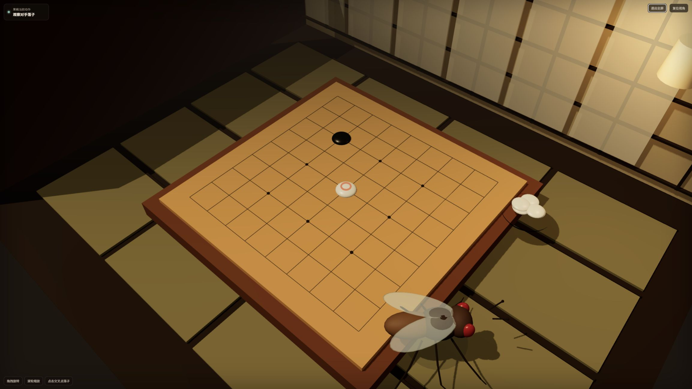

# flygo · 果蝇围棋

在浏览器里，和一只数字果蝇下一盘 9×9 围棋，同时观察它这一手对应的神经模型活动。

**flygo 是由 [icybb0903-sketch](https://github.com/icybb0903-sketch) 维护的实验性果蝇围棋项目。围棋已经可以对弈，棋力、训练方法和使用体验仍在完善。** 本仓库当前发布的是果蝇围棋，不包含 21 点、钢琴、棒球或飞行玩法。

你执黑，果蝇执白。白棋经过“棋盘编码 → MaleCNS 工程 LIF 模拟 → 已训练输出层 → 合法动作掩码”选择落点；右侧神经活动与左侧落子使用同一次决策的记录。

> 真实的是连接组结构数据；神经动力学、感觉输入、输出映射和果蝇动画包含工程设计。这不是活体果蝇脑成像，也没有证明果蝇理解围棋或具备意识。项目不是 Google 官方产品。



## 当前可以做什么

- 人类执黑，与神经策略执白的果蝇进行 9×9 对弈。
- 在三维棋房点击落子，拖拽旋转视角、滚轮缩放。
- 查看同一决策的模型节点、电位与已记录脉冲，不用装饰性放电代替神经结果。
- 悔棋、重新开始、停一手、认输，以及动作回放的暂停、单步和调速。
- 查看模型与检查点状态；缺失或校验失败时明确报错，不暗中切换到专家策略。
- 使用随仓库提供的离线训练与评测脚本，研究输出层的学习表现。

**尚未完善**：棋力与终局策略、复杂死活裁判、稳定的独立评估，以及更方便的安装体验。可以玩不等于已经达到强围棋 AI 的水平。

## 快速开始：Windows

需要 **Python 3.12、Git，以及支持 WebGL 的现代浏览器**。Windows 原生即可运行，不必安装 Linux 虚拟机，也不需要 Node.js、Rust、API Key 或 neuPrint token。

打开 PowerShell：

```powershell
git clone --filter=blob:none --single-branch https://github.com/icybb0903-sketch/flygo.git
cd flygo
py -3.12 -m venv .venv
.\.venv\Scripts\python.exe -m pip install -r requirements.txt
.\.venv\Scripts\python.exe scripts\run_flygo.py
```

然后打开 **[http://127.0.0.1:8000](http://127.0.0.1:8000)**，或 [http://127.0.0.1:8000/go](http://127.0.0.1:8000/go)。

如果 `py -3.12` 不可用，请用你安装的 Python 3.12 可执行文件执行 `-m venv .venv`。后续命令使用项目自己的虚拟环境；**不需要激活环境或修改 PowerShell 执行策略**。

保持终端运行；关闭游戏服务时按 `Ctrl+C`。

不想使用 Git，也可在 GitHub 的 **Code → Download ZIP** 下载当前源码，解压并进入文件夹，然后从创建 `.venv` 那一步开始。克隆命令的过滤选项可以避免下载无关的历史大文件。

### macOS / Linux

使用已安装的 Python 3.12：

```bash
git clone --filter=blob:none --single-branch https://github.com/icybb0903-sketch/flygo.git
cd flygo
python3.12 -m venv .venv
.venv/bin/python -m pip install -r requirements.txt
.venv/bin/python scripts/run_flygo.py
```

当前发布验证在 Windows 完成；其他平台提供相同的 Python 启动方式，尚未做同等程度的桌面验收。

### 模型资源已经带了吗？

已包含普通对弈需要的资源：

| 资源 | 位置 | 说明 |
| --- | --- | --- |
| MaleCNS 运行图 | `data/malecns/runtime/malecns-v1.0-w5-3acb6434e71160fc/` | 约 46.11 MiB，启动时校验 |
| 默认已训练输出层 | `data/checkpoints/stage4/` | 权重、偏置与训练来源清单 |
| 基础校验子图 | `data/p1/` | 共享后端所需的校验数据 |
| 本地 three.js | `app/vendor/` | 三维渲染库与原许可证 |

**试玩不需要下载 1 GB 多的原始 Feather 数据，也不需要先训练。** 首次安装 NumPy 需要联网，之后页面与模型由本地服务提供。

仓库没有公开的在线试玩部署。GitHub 页面是源码和说明，不是游戏服务；不要双击 HTML 文件通过 `file://` 打开。

## 怎么下棋

1. 等待服务与神经策略载入。策略应显示已训练，控制器为 `malecns-neural-policy`。
2. 你执黑，点击棋盘交叉点落子。服务端验证合法性后，果蝇生成白方决策并播放动作。
3. 果蝇拿取、携带和释放棋子是展示层动画；实际棋步由服务端提交，不是动画替你选位置。
4. `暂停`、`单步`、`速度`用于检查动作回放，不代表增加训练次数或计算精度。
5. `悔棋`撤销一整轮，`重新开始`重置当前棋局。
6. 双方连续停一手后按中国面积规则计分，白贴 7.5 目；认输立即结束。

游戏进行中的盘面分数只是参考，不是最终胜负。本项目没有完整的死子协商与专业死活裁判流程；残留死子按当前盘面计算。具体规则见 [围棋规则](docs/GO_RULES.md)。

服务里的棋局保存在内存中，不是永久存档；重启服务会新建棋局。同一个服务实例共享一个对局，不适合直接作为多人网站部署。

## 神经模型和学习机制

运行图含 **139,662 个有位置与分类信息的模型节点、5,536,347 条筛选后有向连接**，来自 MaleCNS v1.0 数据。它不是完整原始连接组的所有节点与记录。

```text
9×9 棋盘与合法动作
        ↓
415 维棋盘编码 → 工程感觉输入
        ↓
固定的 MaleCNS 连接图 + 工程 LIF 动力学
        ↓
同一模拟帧的 128 维神经输出特征
        ↓
已训练的 128→82 线性读出 + 合法动作掩码
        ↓
81 个落点之一，或停一手
```

连接图在对弈时保持固定。默认输出层已经接受离线训练，运行期不访问离线教师，也不调用 baseline 来代替神经落子。资源缺失、过期决策或计算失败时停止该步并报错。

**普通对弈目前不会边玩边自动更新输出层，也不能保证越玩越强。** 继续训练需要单独运行离线脚本并评测新检查点。当前成果是可运行、可追溯的工程实验，不是已经证明比随机策略或其他网络更强的果蝇智能。

三维神经形态使用运行图的真实 soma 坐标；颜色和亮度来自模型计算，而不是活体测量。显示的部分活动、连接和脉冲存在展示预算或截断，不能把屏幕上可见数量当作全部运算规模。

## 修改、训练与验证

修改前端可从 `app/go.html`、`app/go.css`、`app/go.js` 开始。修改 Python 后端后需重启服务。

| 位置 | 用途 |
| --- | --- |
| `scripts/run_flygo.py` | 围棋专用启动入口 |
| `app/server.py` | 本地 API、模型与策略加载 |
| `src/go_engine.py` | 9×9 规则与面积计分 |
| `src/go_session.py` | 对局状态与提交、悔棋 |
| `src/go_neural_encoding.py` | 棋盘编码与动作映射 |
| `src/malecns_dynamics.py` | 工程神经动力学与同帧输出特征 |
| `src/malecns_policy.py` | 检查点校验与策略读出 |
| `scripts/train_neural_go_readout.py` | 离线数据生成与输出层训练 |
| `scripts/evaluate_neural_go_games.py` | 整局评测 |
| `tests/` | 规则、神经契约、服务和训练工具测试 |

先在独立目录生成实验缓存和新检查点，不要覆盖默认 `stage4`。训练流程、命令和评估边界见 [开发说明](docs/DEVELOPMENT.md)。

完整测试需要额外的数据处理依赖：

```powershell
.\.venv\Scripts\python.exe -m pip install -r requirements-phase3.txt
.\.venv\Scripts\python.exe -m unittest discover -s tests -v
```

一些共享后端模块仍保留早期实验台与监控工具的实现和回归测试，供开发使用；**围棋专用启动入口不开放这些页面、监控 API 或概率基线落子接口**。仓库不携带私人 Agent 日志、训练缓存、失败候选、原始大型数据或本机虚拟环境。

## 常见问题

**模型或策略不可用？** 确认下载完整，尤其是运行图的六个 `.npy` 与清单，以及默认检查点的三个文件。它们需匹配已有哈希；不要通过改清单跳过校验。

**8000 端口被占用？** 使用 `scripts/run_flygo.py --port 8010`，并访问 `http://127.0.0.1:8010`。

**落子后等待较久？** 全图模型计算有开销，耗时取决于机器和局面。动画速度不等于推理速度；出错时不会用“假神经落子”补齐。

**神经面板部分评测数据不可获取？** 这个发布包只携带默认运行资源，不包含本机历次开发评测报告。缺失项如实显示，不填写推测胜率；不影响正常对弈。

**能放到公网给大家玩吗？** 目前服务仅监听 `127.0.0.1`，没有多人隔离、身份验证或生产部署保障。请先本地体验，不要直接把开发服务器暴露到互联网。

**它是强围棋 AI 吗？** 不是。它能走合法棋步，但棋力、自然终局能力和连接组信号的实际贡献仍需独立验证。

欢迎通过 [Pull requests](https://github.com/icybb0903-sketch/flygo/pulls) 提交改进。反馈时请附系统、Python 版本、复现步骤和错误，不要上传密码或私人日志。

## 来源与许可证

- flygo 的围棋应用、文档与维护：[icybb0903-sketch](https://github.com/icybb0903-sketch)。项目代码采用 [MIT](LICENSE)，第三方资源除外。
- MaleCNS 数据：FlyEM / HHMI Janelia、University of Cambridge、MRC Laboratory of Molecular Biology 与 Google Research 合作发布，[原始来源](https://male-cns.janelia.org/download/)，[CC BY 4.0](https://creativecommons.org/licenses/by/4.0/)。本仓库进行了节点筛选、连接阈值过滤、CSR 转换与工程化映射；这些修改不是官方模型或背书。
- three.js：保留 [原许可证](app/vendor/THREE_LICENSE.txt)。
- 工程与展示参考：Housefly、fly-blackjack。它们是参考来源，不是本仓库的围棋成品，也不代表作者认可当前实验。详见 [第三方说明](THIRD_PARTY_NOTICES.md)。

---

## English

flygo is an experimental 9×9 Go / weiqi demo: you play Black, a digital fruit fly plays White, and the UI shows the same modeled neural frame used for its move.

Install Python 3.12, create a project-local `.venv`, install `requirements.txt`, and run `scripts/run_flygo.py`. Open `http://127.0.0.1:8000`. The verified runtime graph and default trained readout are included; no VM, API token or raw-dataset download is required to play.

The graph is fixed; learning belongs to an offline-trained engineered readout. Playing does not currently train it online. This is not validated biological fly cognition or a strong Go engine. Code is MIT; MaleCNS-derived data is CC BY 4.0.
